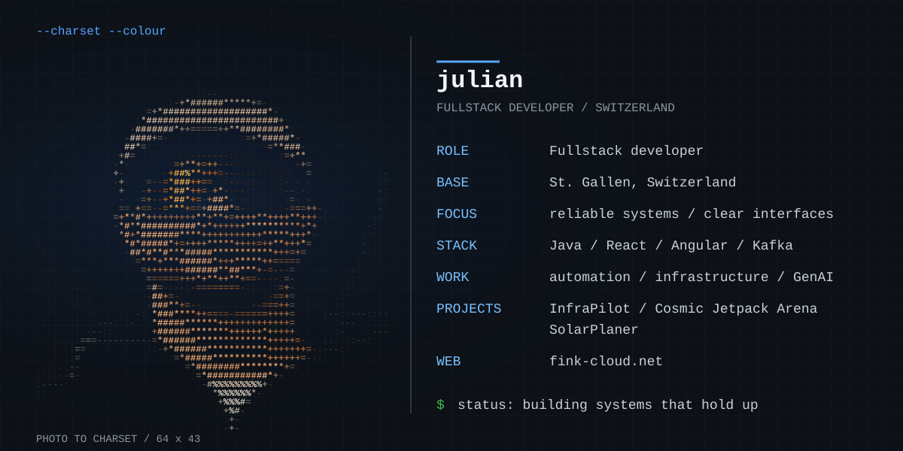

[Website](https://fink-cloud.net) · [LinkedIn](https://www.linkedin.com/in/julian-fink-a175451b4)

## Building systems that hold up

I build software for real-world systems: from clear frontend interfaces to reliable backend integrations, automation and observable infrastructure.

### Selected work

- **[InfraPilot](https://www.info.fink-cloud.net)** — a self-hosted operations console for building, deploying and observing applications on a Linux server.
- **[Cosmic Jetpack Arena](https://cosmic-shooter.fink-cloud.net)** — an open multiplayer PvP game on a cosmic 3D map with jetpacks, weapons and hidden vehicles.
- **SolarPlaner** — a React Native app for planning solar modules on roof imagery.
- **Production integrations** — Java, Angular, Kafka Streams, automation, monitoring and infrastructure work.

### Core stack

`Java` · `React` · `Angular` · `TypeScript` · `Kafka` · `Spring Boot` · `Quarkus` · `React Native` · `Kubernetes` · `CI/CD`

---

> From alpine roots to production systems.
